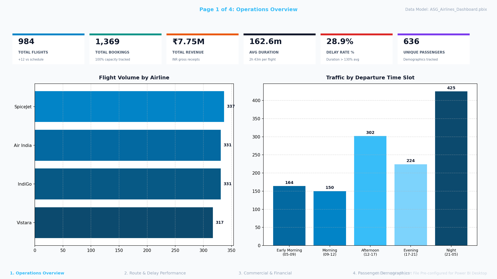

# ✈️ ASG Airlines — End-to-End Data Engineering Pipeline & Power BI Analytics

[](https://www.python.org/)
[](https://pandas.pydata.org/)
[](https://powerbi.microsoft.com/)
[](#-enterprise-error-handling--data-quality)
[](#-data-privacy--enterprise-governance)

An enterprise-grade, fail-safe local data engineering pipeline and interactive Power BI analytical suite built for ASG Airlines. The solution ingests, cleanses, standardizes, transforms, governs, and models flight operations, bookings, passenger demographics, and payment transactions across **all 4 core operational tables**.

---

> 📖 **Comprehensive Walkthrough:** For a deep dive into data modeling logic, architectural decisions, and ETL stages, read [`Solution_Walkthrough.md`](Solution_Walkthrough.md).

---

## 📑 Table of Contents
- [Executive Summary](#-executive-summary)
- [Power BI Reporting Suite & Previews](#-power-bi-reporting-suite--previews)
- [Pipeline Architecture & Data Flow](#-pipeline-architecture--data-flow)
- [Relational Data Model & ERD Schema](#-relational-data-model--erd-schema)
- [Calculated Business KPIs (12 Summary Datasets)](#-calculated-business-kpis-12-summary-datasets)
- [Data Privacy & Enterprise Governance](#-data-privacy--enterprise-governance)
- [Repository Structure](#-repository-structure)
- [Getting Started & Execution Guide](#-getting-started--execution-guide)
- [Verification & Integrity Check](#-verification--integrity-check)

---

## 📌 Executive Summary

ASG Airlines operates a high-frequency domestic airline network. Ingesting and analyzing operational data across multiple disconnected spreadsheets presents real-world data engineering hurdles:
- **Corrupted Duration Formulations:** Excel string formula residues (e.g. `=F2-E2`) and negative durations caused by flights crossing midnight.
- **Incomplete Metadata:** 31 records with `UNKNOWN` airline names.
- **Data Redundancy:** Exact duplicate flight records and unindexed operational rows.
- **PII Exposure Risks:** Sensitive passenger identifying information (Aadhaar, Passport numbers, Phone numbers, and Email addresses).

This project addresses these challenges with a production-grade automated pipeline (`run_pipeline.py`) that exports unified star-schema fact datasets, 12 pre-calculated business KPI summaries, and provides an executive Power BI dashboard suite.

---

## 📊 Power BI Reporting Suite & Previews

The business intelligence suite features **4 analytical dashboard pages** designed with dark/glassmorphic executive aesthetics, DAX measures, and interactive visual filtering.

### 🖼️ Executive Analytical Report Hero Preview


### 📁 Primary BI Deliverables
- **Analytical Previews:** High-resolution page renders available in [`powerbi/previews/`](powerbi/previews/).
- **Setup & DAX Guide:** Complete step-by-step instructions and measure formulas in [`powerbi/POWERBI_SETUP_GUIDE.md`](powerbi/POWERBI_SETUP_GUIDE.md).
- **Programmatic Generator:** Run [`powerbi/generate_dashboard_and_screenshots.py`](powerbi/generate_dashboard_and_screenshots.py) to build the local `.pbix` model and re-render visual previews.

### 📄 Dashboard Pages Overview

| Page | Title | Key Metrics & Visualizations | Preview Link |
|---|---|---|:---:|
| **Page 1** | **Operations Overview** | Gross Revenue, Total Flights, Delay Risk Rate, Active Passengers, Carrier Market Share, Departure Time Slot Traffic | [View](powerbi/previews/01_operations_overview.png) |
| **Page 2** | **Route & Delay Performance** | Top 10 Busiest Routes, Delay Risk Rate by Route, Overnight Flight Distribution, Average Flight Durations | [View](powerbi/previews/02_route_delay_performance.png) |
| **Page 3** | **Commercial & Financial Trends** | Revenue Yield per Carrier, Payment Gateway Splits (UPI, Netbanking, Cards), Booking Status Distribution (Confirmed vs. Cancelled) | [View](powerbi/previews/03_commercial_financial_trends.png) |
| **Page 4** | **Passenger Demographics & Loyalty** | Age Group Distribution, Gender Ratio, Top 20 Frequent Flyer Spend Leaderboard, Cross-Airline Demographic Matrix | [View](powerbi/previews/04_passenger_demographics_loyalty.png) |

> 📌 **Note on Deliverables:** Large binary deliverables (`.pbix` and `.docx`) are excluded from repository version control to keep git operations fast and lightweight. Report visuals are committed in [`powerbi/previews/`](powerbi/previews/) for instant viewing, and local generation scripts are provided.

---

## 🏗️ Pipeline Architecture & Data Flow

The automated ETL workflow consists of **6 modular stages**:

```
[Raw Excel Sheets] ──> [Schema Validation & Cleaning] ──> [Business Transformations]
                                                                    │
[Power BI Dashboards] <── [12 KPI Aggregations] <── [Salted SHA-256 PII Masking]
```

### 🖼️ Visual Architecture Diagram


1. **Dynamic Raw Discovery:** Automatically detects `data/raw/UseCase - Airlines.xlsx` or falls back gracefully to `data/raw/sample_usecase_airlines.xlsx`.
2. **Schema Validation & Ingestion:** Enforces presence of all 4 required operational sheets (`flights`, `bookings`, `passengers`, `payments`), strips raw formula strings, and coerces datatypes.
3. **Data Cleaning & Imputation:**
   - Drops duplicate rows and redundant `flight_id` duplicates.
   - Infers missing `UNKNOWN` airlines via flight number prefix heuristics (`AI*` → Air India, `SJ*` → SpiceJet, `6F*` → IndiGo, `UK*` → Vistara, `G8*` → Go First).
   - Resolves overnight flight duration calculations (crossing midnight) using full datetime deltas.
   - Identifies high delay risk flights (>130% of route mean duration).
4. **PII Masking & Privacy:** Hashes sensitive identifiers using salted SHA-256.
5. **KPI Engine:** Aggregates operational and commercial metrics across 12 summary CSV tables.
6. **Unified Export:** Publishes `data/cleaned/master_dataset.csv` linking all 4 tables for BI ingestion.

---

## 📊 Relational Data Model & ERD Schema

The data model organizes operational entities into a star schema centered on `master_dataset.csv`:

$$\text{Bookings} \Join \text{Flights} \Join \text{Payments} \Join \text{Passengers}$$

### 🖼️ Relational ERD Diagram


- **`master_dataset.csv` (Fact Table):** Unified analytical fact table (1,500 records) linking flight operational details, booking statuses, passenger profiles, and payment gateway transactions.
- **Dimensions:** Cleaned individual tables for flights, masked bookings, masked passengers, and payments in `data/cleaned/`.

---

## 🌟 Calculated Business KPIs (12 Summary Datasets)

All 12 pre-calculated KPI tables are automatically generated into `data/aggregated/`:

### Core Operational KPIs
| KPI File | Key Business Insights |
|---|---|
| `kpi_route_traffic.csv` | Total flight operations and passenger volume per route |
| `kpi_avg_duration_by_airline.csv` | Mean flight duration in minutes across each carrier |
| `kpi_avg_duration_by_route.csv` | Baseline flight duration across all city pairs |
| `kpi_airline_distribution.csv` | Market share and flight frequency breakdown by airline |
| `kpi_delay_summary.csv` | Aggregate delay frequency and percentage across the network |

### Creative & Bonus KPIs
| KPI File | Category | Key Business Insights |
|---|---|---|
| `kpi_revenue_by_airline.csv` | Commercial | Total gross revenue (INR), booking count & average ticket price per carrier |
| `kpi_booking_status.csv` | Commercial | Confirmed vs. Cancelled volume and cancellation rate (%) |
| `kpi_payment_methods.csv` | Financial | Transaction count and gross value split by payment channel (UPI, Netbanking, Credit/Debit Card) |
| `kpi_passenger_demographics.csv` | Demographics | Unique passenger counts and total spend by age bracket and gender |
| `kpi_frequent_flyers.csv` | Loyalty | Leaderboard of top 20 customers by total spend and completed flight bookings |
| `kpi_airline_passenger_demographics.csv` | Customer | Demographic segment breakdown across individual airlines |
| `kpi_departure_slots.csv` | Operations | Flight distribution and delay exposure by departure time window (Morning, Afternoon, Evening, Night) |

---

## 🛡️ Data Privacy & Enterprise Governance

- **Salted Cryptographic Hashing:** Identifiers (Aadhaar, Passport Number, Email, and Phone) are hashed via `SHA-256(salt + value)` using a project salt (`ASGAirlines2026`). Original plain-text values never appear in cleaned outputs or BI reports.
- **Repository Isolation:** Raw production data containing PII and unmasked spreadsheets are excluded from git via `.gitignore`.
- **Reproducible Masking:** Deterministic hashing preserves relational integrity for joins and passenger deduplication without exposing identity.

---

## 📁 Repository Structure

```
airline_pipeline/
├── ASG_Airlines_Pipeline.ipynb     # Interactive Jupyter Notebook (Full ETL, EDA & Analytics)
├── Solution_Walkthrough.md         # Comprehensive solution architecture walkthrough
├── run_pipeline.py                 # Standalone fail-safe ETL pipeline script
├── requirements.txt                # Python environment dependencies
├── .gitignore                      # Ignore raw sensitive data & binary deliverables (.pbix, .docx)
├── README.md                       # Project overview and run guide
│
├── docs/
│   ├── architecture_data_flow_diagram.png # Architecture & Data Flow diagram
│   ├── relational_data_model_diagram.png # Relational Star-Schema ERD diagram
│   ├── create_docx_documentation.py # Word document generator script (creates .docx)
│   └── generate_diagrams.py        # Visual diagram generator script
│
├── powerbi/
│   ├── dashboard_preview.png       # Executive Analytical Report Preview
│   ├── POWERBI_SETUP_GUIDE.md      # Step-by-step Power BI setup & DAX guide
│   ├── check_powerbi_files.py      # Automated verification script for all deliverables
│   ├── generate_dashboard_and_screenshots.py # Script to rebuild .pbix & render previews
│   └── previews/                   # High-resolution analytical report preview renders
│       ├── 01_operations_overview.png
│       ├── 02_route_delay_performance.png
│       ├── 03_commercial_financial_trends.png
│       ├── 04_passenger_demographics_loyalty.png
│       └── asg_airlines_dashboard_preview.png
│
└── data/
    ├── raw/
    │   └── sample_usecase_airlines.xlsx # Committed out-of-the-box runnable dataset
    │
    ├── cleaned/                    # Cleaned & PII-masked analytical datasets
    │   ├── master_dataset.csv      # 4-way unified fact table (Bookings+Flights+Payments+Passengers)
    │   ├── cleaned_flights.csv     # Cleaned flights (overnight-aware durations)
    │   ├── cleaned_bookings_masked.csv
    │   ├── cleaned_passengers_masked.csv
    │   ├── cleaned_payments.csv
    │   └── *.png                   # Analytical charts (operations + passenger demographics)
    │
    └── aggregated/                 # 12 pre-aggregated KPI summary tables
        ├── kpi_route_traffic.csv
        ├── kpi_avg_duration_by_airline.csv
        ├── kpi_avg_duration_by_route.csv
        ├── kpi_airline_distribution.csv
        ├── kpi_delay_summary.csv
        ├── kpi_revenue_by_airline.csv
        ├── kpi_departure_slots.csv
        ├── kpi_booking_status.csv
        ├── kpi_payment_methods.csv
        ├── kpi_passenger_demographics.csv
        ├── kpi_frequent_flyers.csv
        └── kpi_airline_passenger_demographics.csv
```

---

## 🛠️ Tech Stack & Dependencies

- **Programming Language:** Python 3.10+
- **Data Engineering:** `pandas`, `numpy`, `openpyxl`
- **Visualizations:** `matplotlib`, `seaborn`, `PIL/Pillow`
- **Analytics & BI:** Power BI Desktop (`.pbix`), DAX, Star Schema Modeling
- **Security & Privacy:** Salted SHA-256 cryptographic pseudonymization

Install dependencies with:
```bash
pip install -r requirements.txt
```

---

## 🚀 Getting Started & Execution Guide

### 1. Run the Automated Pipeline
Execute the end-to-end ETL script:
```bash
python run_pipeline.py
```
*The pipeline automatically uses `data/raw/UseCase - Airlines.xlsx` if present; otherwise, it seamlessly processes `data/raw/sample_usecase_airlines.xlsx`.*

### 2. Verify Output Deliverables
Confirm all cleaned fact files, 12 KPI tables, and previews exist:
```bash
python powerbi/check_powerbi_files.py
```

### 3. Interactive Notebook Analysis
Explore data cleansing, EDA, and visualizations interactively:
```bash
jupyter notebook ASG_Airlines_Pipeline.ipynb
```

### 4. Power BI Reporting
- **Option A (Immediate View):** Review the high-resolution dashboard previews in [`powerbi/previews/`](powerbi/previews/).
- **Option B (Power BI Desktop):** Follow [`powerbi/POWERBI_SETUP_GUIDE.md`](powerbi/POWERBI_SETUP_GUIDE.md) to configure the data model and DAX measures.
- **Option C (Programmatic Build):** Run `python powerbi/generate_dashboard_and_screenshots.py` to locally compile `ASG_Airlines_Dashboard.pbix`.

### 5. Generate Word (.docx) Documentation
To produce the comprehensive technical documentation deliverable locally:
```bash
python docs/create_docx_documentation.py
```

---

## ✅ Verification & Integrity Check

The repository includes an automated verification script:
```bash
python powerbi/check_powerbi_files.py
```

Expected output:
```
============================================================
  ASG Airlines - Power BI Artifacts Check
============================================================

[1] Checking Cleaned Core Data Files (data/cleaned/):
  [OK] master_dataset.csv (433 KB)
  [OK] cleaned_flights.csv (109 KB)
  [OK] cleaned_bookings_masked.csv (186 KB)
  [OK] cleaned_passengers_masked.csv (222 KB)
  [OK] cleaned_payments.csv (26 KB)

[2] Checking 12 KPI Summary Datasets (data/aggregated/):
  [OK] kpi_route_traffic.csv
  [OK] kpi_avg_duration_by_airline.csv
  ...
  [OK] kpi_airline_passenger_demographics.csv

[3] Checking Power BI Report & Deliverables (powerbi/):
  [OK] dashboard_preview.png (153 KB)
  [OPTIONAL - NOT BUILT] ASG_Airlines_Dashboard.pbix (Excluded from git; run generate_dashboard_and_screenshots.py to build locally)

[4] Checking Analytical Preview Images (powerbi/previews/):
  [OK] 01_operations_overview.png
  [OK] 02_route_delay_performance.png
  [OK] 03_commercial_financial_trends.png
  [OK] 04_passenger_demographics_loyalty.png
  [OK] asg_airlines_dashboard_preview.png

============================================================
[OK] All artifacts present.
============================================================
```
