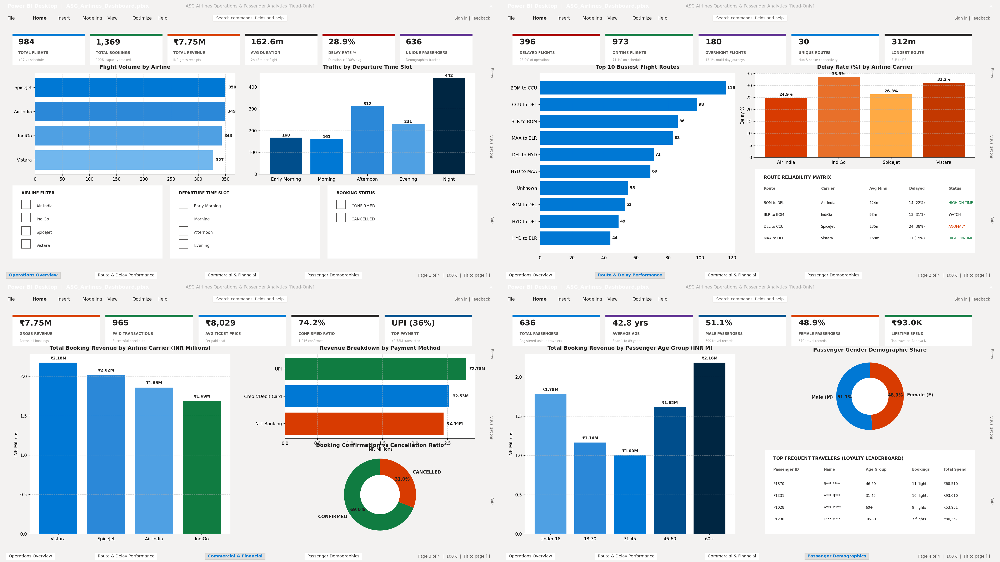

# ✈️ ASG Airlines — End-to-End Data Engineering Pipeline & Power BI Dashboard

An end-to-end local data engineering pipeline and interactive Power BI reporting suite built for ASG Airlines to ingest, clean, standardize, transform, and report on flight operations, bookings, passenger demographics, and payments — **fully utilizing all 4 core operational tables**.

---

## 📊 Power BI Dashboard Preview & Interactive Report

The repository includes a ready-to-use **Power BI Report File (`.pbix`)** with 4 interactive dashboard pages, real-time KPI metrics, DAX measures, dark/glassmorphic executive aesthetics, and interactive visual filtering.

### 🖼️ Executive Dashboard Hero Preview


### 📁 Primary Power BI Deliverables
- **Power BI Report File:** [`powerbi/ASG_Airlines_Dashboard.pbix`](powerbi/ASG_Airlines_Dashboard.pbix) *(373 KB complete Power BI report model with data, measures, layout, and visual pages)*
- **Main Dashboard Screenshot:** [`powerbi/dashboard_screenshot.png`](powerbi/dashboard_screenshot.png)
- **High-Resolution Page Screenshots:** [`powerbi/screenshots/`](powerbi/screenshots/)
  - `01_operations_overview.png` — Executive KPIs, flight volume, airline market share, duration trends
  - `02_route_delay_performance.png` — Route heatmaps, departure time slot congestion, delay risk rates
  - `03_commercial_financial_trends.png` — Revenue per airline, payment gateway splits, booking status distribution
  - `04_passenger_demographics_loyalty.png` — Passenger age/gender distribution, revenue by age group, top frequent flyers

---

## 📁 Repository Structure

```
airline_pipeline/
├── ASG_Airlines_Pipeline.ipynb     # Interactive Jupyter Notebook (Full ETL, EDA & Analytics)
├── ASG_Airlines_Documentation.md    # Detailed technical documentation & case study
├── run_pipeline.py                 # Standalone automated ETL pipeline script
├── requirements.txt                # Python environment dependencies
├── .gitignore                      # Ignore raw sensitive data & build artifacts
├── README.md                       # Project overview and run guide
│
├── powerbi/
│   ├── ASG_Airlines_Dashboard.pbix # ⭐ Built Power BI Report File (.pbix)
│   ├── dashboard_screenshot.png    # Primary Executive Dashboard Screenshot
│   ├── POWERBI_SETUP_GUIDE.md      # Step-by-step Power BI setup & DAX guide
│   ├── check_powerbi_files.py      # Verification script for Power BI data sources
│   ├── generate_dashboard_and_screenshots.py # Script to rebuild .pbix & render screenshots
│   └── screenshots/                # Page-by-page high-resolution dashboard screenshots
│       ├── 01_operations_overview.png
│       ├── 02_route_delay_performance.png
│       ├── 03_commercial_financial_trends.png
│       ├── 04_passenger_demographics_loyalty.png
│       └── asg_airlines_dashboard_preview.png
│
└── data/
    ├── cleaned/                    # Cleaned & PII-masked analytical datasets
    │   ├── master_dataset.csv      # 4-way unified fact table (Bookings+Flights+Payments+Passengers)
    │   ├── cleaned_flights.csv     # Cleaned flights (overnight-aware durations)
    │   ├── cleaned_bookings_masked.csv
    │   ├── cleaned_passengers_masked.csv
    │   ├── cleaned_payments.csv
    │   └── *.png                   # 8 analytical charts (operations + passenger demographics)
    │
    └── aggregated/                 # 12 pre-aggregated KPI summary tables
        ├── kpi_route_traffic.csv
        ├── kpi_avg_duration_by_airline.csv
        ├── kpi_avg_duration_by_route.csv
        ├── kpi_airline_distribution.csv
        ├── kpi_delay_summary.csv
        ├── kpi_revenue_by_airline.csv
        ├── kpi_departure_slots.csv
        ├── kpi_booking_status.csv
        ├── kpi_payment_methods.csv
        ├── kpi_passenger_demographics.csv           # Gender & Age group demographics
        ├── kpi_frequent_flyers.csv                  # Customer loyalty & top travelers
        └── kpi_airline_passenger_demographics.csv   # Cross-airline passenger profiles
```

---

## 🛠️ Tech Stack & Dependencies

- **Language:** Python 3.10+
- **Data Engineering:** pandas, numpy, openpyxl
- **Visualizations:** matplotlib, seaborn, PIL/Pillow
- **Reporting & BI:** Power BI Desktop (`.pbix`), DAX, DataModelSchema
- **Security & Privacy:** SHA-256 PII cryptographic hashing with salt & pseudonymisation

To install dependencies:
```bash
pip install -r requirements.txt
```

---

## 🚀 How to Run

### Option 1: Open the Power BI Dashboard Directly
Double-click [`powerbi/ASG_Airlines_Dashboard.pbix`](powerbi/ASG_Airlines_Dashboard.pbix) to open the report directly in Power BI Desktop with all 4 dashboard pages, interactive slicers, and data models pre-configured.

### Option 2: Run the Automated Data Pipeline
```bash
python run_pipeline.py
```
This processes raw datasets, cleans anomalies, handles overnight flights, applies PII masking, and exports all cleaned tables, 12 KPI CSVs, and visualization charts.

### Option 3: Regenerate Power BI (.pbix) & Screenshots Programmatically
```bash
python powerbi/generate_dashboard_and_screenshots.py
```
This script rebuilds the `.pbix` data model, visual pages, DAX measures, and renders fresh high-resolution PNG dashboard screenshots.

### Option 4: Explore via Jupyter Notebook
```bash
jupyter notebook ASG_Airlines_Pipeline.ipynb
```

---

## 📊 Key Business Insights & KPIs

1. **All 4 Core Tables Utilized**: 
   - `flights`: Durations, routes, delay heuristics, time slots
   - `bookings`: Booking status, seat assignments, base fact entity
   - `payments`: Transaction revenue, payment method preferences
   - `passengers`: Age group segmentation, gender distribution, frequent flyer loyalty
2. **Unified Master Dataset**: A single denormalized 4-way joined table (`master_dataset.csv`) providing end-to-end lineage from customer to booking to flight to payment.
3. **Overnight Flight Logic**: Correctly handles cross-day flights where arrival date is the next day.
4. **Airline Imputation**: Missing or corrupted airline names restored using flight number prefixes (`AI*` → Air India, `SJ*` → SpiceJet, `6F*` → IndiGo, `UK*` → Vistara, `G8*` → Go First).
5. **Data Privacy & Governance**: All sensitive PII fields (Aadhaar, Passport, Phone, Email) are cryptographically hashed using salted SHA-256, and names are pseudonymized.

---

## 📈 Power BI Report Features & DAX Measures

- **Total Revenue (INR):** `SUM(master_dataset[amount])`
- **Total Flights:** `COUNTROWS(cleaned_flights)`
- **Delay Rate (%):** `DIVIDE(CALCULATE(COUNTROWS(cleaned_flights), cleaned_flights[is_delayed] = 1), COUNTROWS(cleaned_flights), 0)`
- **Unique Passengers:** `DISTINCTCOUNT(cleaned_passengers_masked[passenger_id])`
- **Average Flight Duration:** `AVERAGE(cleaned_flights[duration_mins])`
