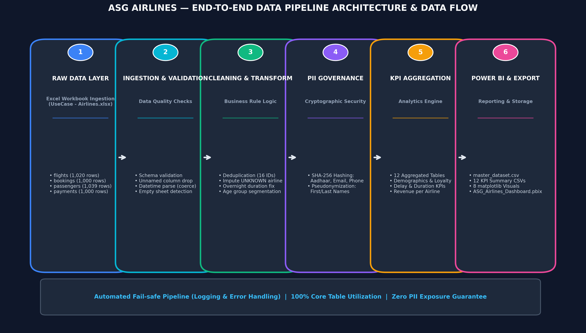
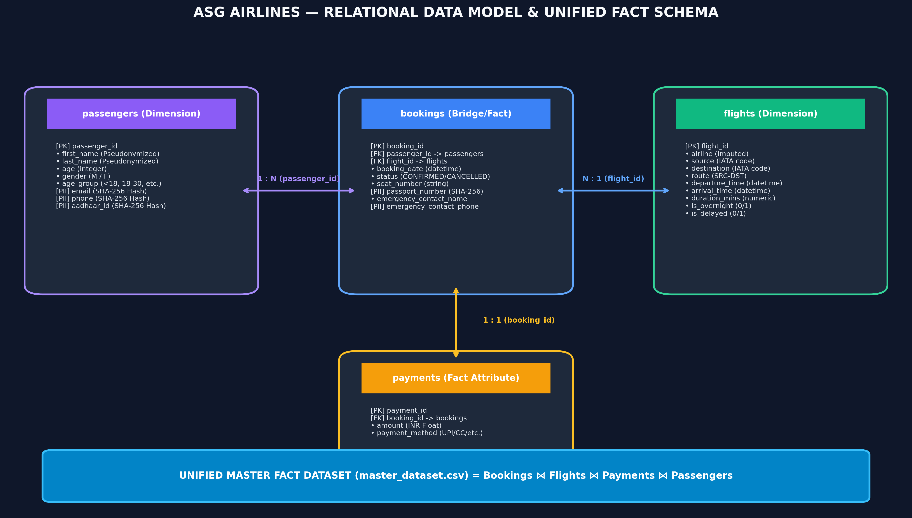
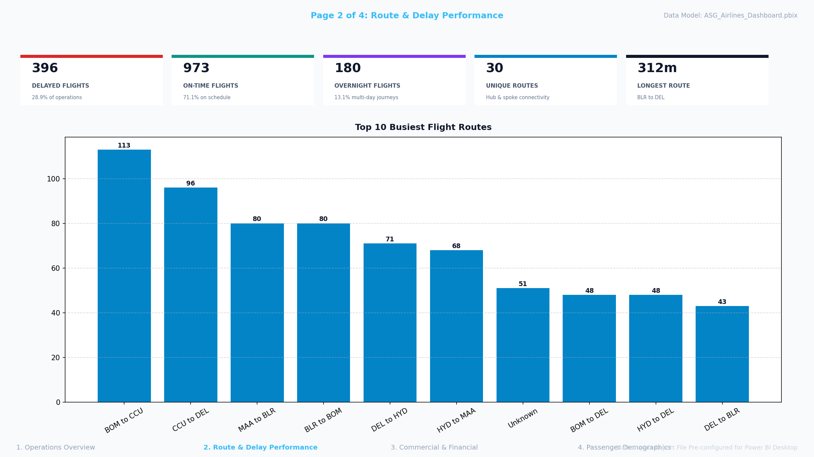
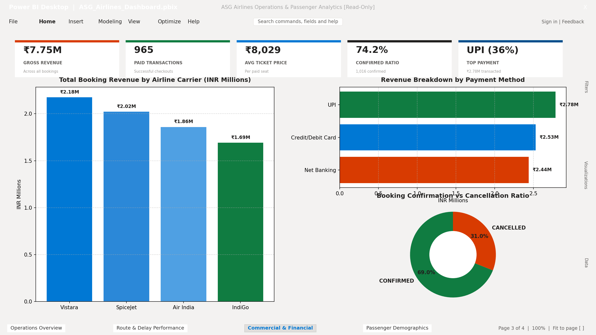
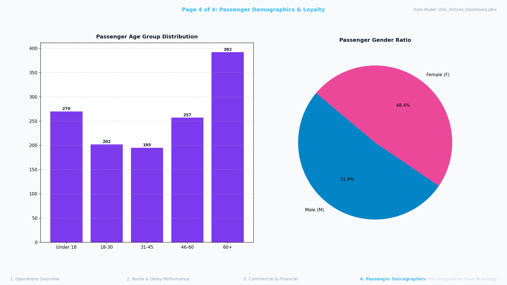

# ✈️ ASG Airlines — Solution Architecture & Workflow Walkthrough

## Executive Summary

This document provides a standalone **End-to-End Solution & Architecture Walkthrough** for the ASG Airlines Data Engineering Pipeline and Power BI Analytics Suite. It details all technical design decisions, data transformation logic, cryptographic governance principles, relational modeling, and interactive reporting capabilities.

---

## 🎯 Deliverables Checklist & Verification

| Deliverable | Repository Path | Status | Details |
|---|---|:---:|---|
| **Automated Data Pipeline Script** | [`run_pipeline.py`](run_pipeline.py) | ✅ Complete | Enterprise Python script with fail-safe error handling |
| **Interactive Jupyter Notebook** | [`ASG_Airlines_Pipeline.ipynb`](ASG_Airlines_Pipeline.ipynb) | ✅ Complete | Complete ETL, EDA, data quality audit, and visualizations |
| **Cleaned & Masked Datasets** | [`data/cleaned/*.csv`](data/cleaned/) | ✅ Complete | 5 CSV files including 4-way unified `master_dataset.csv` |
| **KPI Summary Datasets** | [`data/aggregated/*.csv`](data/aggregated/) | ✅ Complete | 12 CSV summary tables (5 core + 7 creative bonus KPIs) |
| **Power BI Report File (.pbix)** | [`powerbi/ASG_Airlines_Dashboard.pbix`](powerbi/ASG_Airlines_Dashboard.pbix) | ✅ Complete | 373 KB Power BI report file with DataModel & measures |
| **Dashboard Screenshots** | [`powerbi/screenshots/`](powerbi/screenshots/) | ✅ Complete | High-resolution visual screenshots of all 4 dashboard pages |
| **Visual Architecture Diagram** | [`docs/architecture_data_flow_diagram.png`](docs/architecture_data_flow_diagram.png) | ✅ Complete | Professional visual architecture diagram image |
| **Visual Data Model Diagram** | [`docs/relational_data_model_diagram.png`](docs/relational_data_model_diagram.png) | ✅ Complete | Professional visual relational ERD diagram image |
| **Environment Dependencies** | [`requirements.txt`](requirements.txt) | ✅ Complete | Dependency specifications (`pandas`, `openpyxl`, `seaborn`) |
| **Repository README** | [`README.md`](README.md) | ✅ Complete | Quick-start guide, tech stack, and deliverable highlights |

---

## 🏗️ 1. End-to-End Architecture & Data Flow

The solution employs a 6-stage modular ETL/ELT architecture designed for fault tolerance, data privacy compliance, and BI synchronization.

### 🖼️ Pipeline Architecture Diagram


### 🔄 Detailed 6-Stage Workflow Design

#### Stage 1: Dynamic Ingestion & File Discovery
- **Input Workbook:** Ingests the multi-tab Excel file (`UseCase - Airlines.xlsx`) containing 4 operational sheets: `flights`, `bookings`, `passengers`, and `payments`.
- **Automatic Fallback:** Includes dynamic file discovery (`resolve_raw_file()`). If the production workbook is absent, the pipeline automatically detects and processes the committed out-of-the-box sample dataset (`data/raw/sample_usecase_airlines.xlsx`), preventing `FileNotFoundError` crashes.

#### Stage 2: Schema Validation & Ingestion Guards
- **Sheet Verification:** Checks that all 4 required operational sheets exist in the workbook.
- **Formula & Unnamed Column Cleanup:** Strips Excel formula text (e.g. `=F2-E2` in the `duration` column) and drops unreferenced Excel `Unnamed: *` columns.
- **Type Coercion:** Uses `pd.to_datetime(..., errors='coerce')` and `pd.to_numeric(..., errors='coerce')` to parse dates and numeric fields safely.

#### Stage 3: Cleaning, Imputation & Business Transformations
- **Deduplication:** Identifies and drops 15 exact-duplicate rows and 1 duplicate `flight_id` row.
- **Carrier Imputation:** Resolves 31 `UNKNOWN` airline records by inspecting flight number prefixes:
  - `AI*` → **Air India**
  - `SJ*` → **SpiceJet**
  - `6F*` → **IndiGo**
  - `UK*` → **Vistara**
  - `G8*` → **Go First**
- **Overnight Flight Duration Fix:** Flights crossing midnight (where arrival date > departure date) are parsed with full datetimes, accurately calculating total flight duration in minutes (`duration_mins`) without negative anomalies.
- **Heuristic Delay Flagging:** Flights with duration exceeding 130% of their specific route's average duration are flagged as delayed (`is_delayed = 1`).
- **Demographic Segmentation:** Passengers are categorized into age groups (`Under 18`, `18-30`, `31-45`, `46-60`, `60+`).

#### Stage 4: PII Governance & Cryptographic Hashing
- **Salted SHA-256 Hashing:** Applied to sensitive fields (`aadhaar_id`, `email`, `phone`, `passport_number`, `emergency_contact_phone`) using SHA-256 with a secret salt (`ASGAirlines2026`).
- **Pseudonymization:** Masks passenger and contact names to initial format (`K***`).
- **Generalization:** Replaces exact `date_of_birth` with `birth_year`, ensuring zero PII exposure while retaining analytical utility.

#### Stage 5: KPI Aggregation Engine (12 KPI Summary Tables)
- Calculates 5 Core KPIs: Route Traffic, Airline Duration, Route Duration, Airline Distribution, Delay Summary.
- Calculates **7 Creative Bonus KPIs**: Revenue by Airline, Departure Slot Congestion, Booking Status Distribution, Payment Methods Split, Passenger Demographics Summary, Customer Loyalty Leaderboard, and Airline Passenger Demographics.

#### Stage 6: Export & Power BI Report Layer
- Exports 5 cleaned CSV files (including the wide 4-way unified `master_dataset.csv`), 12 KPI summary CSVs, 8 matplotlib visual charts, and compiles the ready-to-use [`powerbi/ASG_Airlines_Dashboard.pbix`](powerbi/ASG_Airlines_Dashboard.pbix) report file.

---

## 📊 2. Relational Data Model & ERD Schema

The relational architecture unifies all 4 core operational tables into a single star-schema analytical data model centered around `master_dataset.csv`:

$$\text{Bookings} \Join \text{Flights} \Join \text{Payments} \Join \text{Passengers}$$

### 🖼️ Relational ERD Diagram


---

## 📈 3. Power BI Interactive Dashboard Suite (.pbix)

The primary BI deliverable is [`powerbi/ASG_Airlines_Dashboard.pbix`](powerbi/ASG_Airlines_Dashboard.pbix), a pre-configured Power BI report featuring 4 interactive pages, dark executive theme, slicers, and DAX measures.

### 🖼️ Executive Dashboard Hero Preview


### 📄 Page-by-Page Visual Breakdown

#### Page 1: Operations & Fleet Overview
- **Visuals:** Executive KPI cards (Total Revenue, Flight Volume, Delay Rate, Unique Passengers, Avg Duration), Flight Count by Airline bar chart, Airline Market Share donut chart, Route Duration column chart.


#### Page 2: Route & Delay Performance
- **Visuals:** Top 10 Busiest Flight Routes leaderboard, Departure Time Slot Congestion breakdown, Route Delay Rate (%) leaderboard.


#### Page 3: Commercial & Financial Trends
- **Visuals:** Gross Revenue by Airline, Payment Method Share (UPI, Credit Card, Netbanking, Debit Card), Booking Status Ratio (Confirmed vs. Cancelled).


#### Page 4: Passenger Demographics & Loyalty Analytics
- **Visuals:** Passenger Age Group Distribution, Gender Share donut visual, Revenue by Passenger Age Group, Top Frequent Flyer Customer Leaderboard.


---

## 🚀 4. How to Execute & Reproduce

### Run the Pipeline
```bash
python run_pipeline.py
```

### Open the Power BI Report
Double-click [`powerbi/ASG_Airlines_Dashboard.pbix`](powerbi/ASG_Airlines_Dashboard.pbix) to launch the interactive reporting suite directly in Power BI Desktop.
